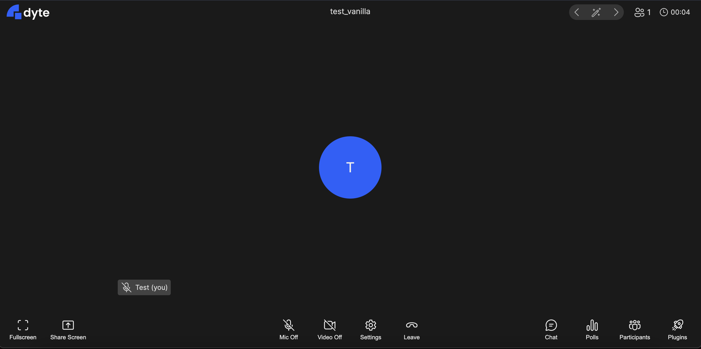
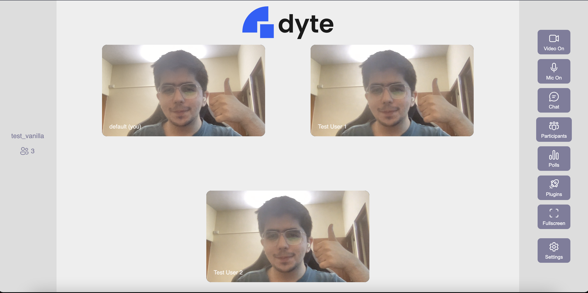

<!-- PROJECT LOGO -->
<p align="center">
  <a href="https://dyte.io">
    
  </a>

  <h3 align="center">Angular JS Sample App</h3>

  <p align="center">
    A basic project demonstrating how you can integrate **dyte** in your Angular app.
    <br />
    <a href="https://docs.dyte.io"><strong>Explore the docs »</strong></a>
    <br />
    <br />
    <a href="https://github.com/dyte-in/angular-sample-app/issues">Report Bug</a>
    ·
    <a href="https://github.com/dyte-in/angular-sample-app/issues">Request Feature</a>
  </p>
</p>

<!-- TABLE OF CONTENTS -->

## Table of Contents

- [About the Project](#about-the-project)
- [Structure](#structure)
- [Application FLow](#application-flow)
- [Getting Started](#getting-started)
  - [Installation](#installation)
- [Usage](#usage)

- [License](#license)

<!-- ABOUT THE PROJECT -->

## About The Project

A basic project with two examples demonstrating how you can integrate **dyte** in your Angular app.

### Built With

- [dyte-angular-ui-kit](https://www.npmjs.com/package/@dytesdk/angular-ui-kit)
- [dyte-web-core](https://www.npmjs.com/package/@dytesdk/web-core)

<!-- GETTING STARTED -->

## Structure

Angular App structure:

```
├── src
│   ├── 📁 dyte-default-config
│   |   ├── dyte-default-config.component.html
│   |   ├── dyte-default-config.component.css
│   |   ├── dyte-default-config.component.ts
│   ├── 📁 dyte-custom-elements
│   |   ├── dyte-custom-elements.component.html
│   |   ├── dyte-custom-elements.component.css
│   |   ├── dyte-custom-elements.component.ts
│   ├── 📁 home
│   |   ├── home.component.html
│   |   ├── home.component.css
│   |   ├── home.component.ts
|   ├── app.component.html
|   ├── app.component.css
|   ├── app.component.ts
```

## Getting Started

Please make sure you have created a room on the [Dyte Developer Portal](https://dev.dyte.io/) and have an auth token that connects to that room generated via our backend apis

### Installation

1. Clone the repo
```sh
git clone https://github.com/dyte-in/angular-sample-app.git
```

2. Install NPM packages
```sh
npm install
```

3. Update `src/environments/environment.ts` with your roomName and authToken
```js
export const environment = {
    ..
    roomName: '',
    authToken: ''
    ..
}
```

4. Run the application
```sh
ng serve --open
```


## Application Flow

### `src/app/home`
A simple homepage on `http://localhost:4200/` which navigates you to the two sample apps we have:

### 1. `src/app/dyte-default-config`
On opening `http://localhost:4200/dyte-default-config` in your browser, we call `DyteClient.init()` which is exposed to us by importing the dyte web core

`DyteClient.init()` returns a dyte meeting object to us which has context on all attributes neccesary for displaying a meeting on our UI

We then add `<dyte-meeting #myid></dyte-meeting>` to our `dyte-default-config.component.html`, dyte-meeting expects the dyte meeting object we initialised earlier as a prop. Once initialised we add the dyteMeeting to our dyte-meeting view child.

Once the meeting object is passed to dyte-meeting it will automatically rerender with the default dyte ui config!



### 2. `public/dyte-custom-elements`
Similar to dyte-default-config we initialise our meeting, and join our room. But this time we don't simply add `<dyte-meeting>` to our dom. We actually use the [dyte ui-kit elements](https://docs.dyte.io/ui-kit/quickstart) to build a different UI using dyte components!

You can checkout `src/dyte-custom-elements/dyte-custom-elements.component` to see how each of these elements are added to our dom we pass the same meeting prop we initialized to each component and listen for certain events to update our UI in `dyte-custom-elements.component.ts`.

We end up with a simple meeting with our own custom UI in very few lines of code!



<!-- USAGE EXAMPLES -->

## Usage

Run Open `localhost:4200/` and choose the sample app you want to see

<!-- You can use this example as a reference on how you can integrate your webapp with dyte. -->

_For documentation on APIs, Web core and ui-kit, please refer to our [official documentation](https://docs.dyte.io)._

<!-- LICENSE -->

## License

Distributed under the MIT License. See [`LICENSE`](./LICENSE) for more information.